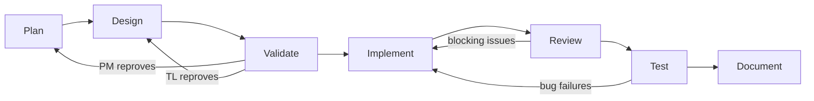

# omni-sw

A Claude Code plugin that implements a multi-agent SDLC workflow. Five role-based agents collaborate across seven sequential phases to take a project from business objective to delivered, documented software.

## Installation

Load the plugin when starting a Claude Code session from your project directory:

```bash
claude --plugin-dir /path/to/omni-sw
```

All skills become available namespaced as `/omni-sw:<skill>`.

## How it works

Each agent is a skill invoked with a phase argument. You drive the workflow by calling agents in order — each reads the artifacts produced by the previous phase and writes the next one.

```
/omni-sw:pm plan  →  /omni-sw:po plan  →  /omni-sw:tl design
→  /omni-sw:pm validate  →  /omni-sw:tl validate
→  /omni-sw:dev implement  →  /omni-sw:tl review
→  /omni-sw:qa test  →  /omni-sw:pm document  →  /omni-sw:tl document
```

Alternatively, let the **Orchestrator** run the entire workflow automatically:

```
/omni-sw:orchestrator "Build a REST API for order management"
```

## Agents

| Skill | Role | Leads phases |
|-------|------|-------------|
| `/omni-sw:pm` | Product Manager | Plan (biz), Validate (biz), Document (biz) |
| `/omni-sw:po` | Product Owner | — (assists PM, produces backlog) |
| `/omni-sw:tl` | Tech Lead | Design, Validate (tech), Review, Document (tech) |
| `/omni-sw:dev` | Developer Specialist | Implement |
| `/omni-sw:qa` | QA Specialist | Test |

## Seven-phase workflow



| # | Phase | Leader | Gate? | Key artifact |
|---|-------|--------|-------|-------------|
| 1 | Plan | PM → PO | — | `docs/PROJECT_BRIEF.md`, `docs/BACKLOG.md` |
| 2 | Design | TL | — | `docs/ARCHITECTURE.md` |
| 3 | Validate | PM + TL | Dual approval | `docs/VALIDATION.md` |
| 4 | Implement | Dev | — | `src/` |
| 5 | Review | TL | Blocking issues | `docs/REVIEW.md` |
| 6 | Test | QA | All tests pass | `tests/`, `docs/TEST_REPORT.md` |
| 7 | Document | PM + TL | — | `README.md`, `CHANGELOG.md`, `docs/API_REFERENCE.md` |

Gate phases enforce quality before progression: both PM and TL must APPROVE to proceed from Validate; blocking issues must be resolved before leaving Review; all tests must pass before reaching Document.

## Setup

### Prerequisites

- Claude Code installed and authenticated
- Python 3.x (used by `agency_cli.py` for deterministic operations)

### Configure a new project

1. Copy the CLAUDE.md template to your project root:
   ```bash
   cp /path/to/omni-sw/docs/templates/CLAUDE_TEMPLATE.md ./CLAUDE.md
   ```

2. Fill in the sections:
   - **Stack** — runtime, framework, database, testing framework
   - **Conventions** — naming, project structure, error handling, logging
   - **Domain Glossary** — ubiquitous language terms
   - **Forbidden Patterns** — anti-patterns your team avoids
   - **Agent Overrides** — per-role adjustments for this project

3. Start a Claude Code session with the plugin loaded:
   ```bash
   claude --plugin-dir /path/to/omni-sw
   ```

4. Begin the workflow:
   ```
   /omni-sw:pm plan
   ```

The agency is stack-agnostic. Agents read `CLAUDE.md` and adapt their output accordingly.

## Automated orchestration

The `/omni-sw:orchestrator` skill drives the full 7-phase workflow end-to-end, spawning agents in the correct sequence, evaluating gates, handling feedback loops, and surfacing questions to you when needed.

### Structured objective (recommended)

For any non-trivial project, write the objective in a dedicated file. Mention it with `@` in the chat so Claude Code loads the file content into context before the orchestrator starts — this gives every spawned agent the full business context from the beginning.

Create `docs/OBJECTIVE.md` in your project root:

```markdown
## Goal
Build an order management REST API with JWT authentication.

## Stakeholders
- Operations team (creates/tracks orders)
- Finance team (reads order history for billing)

## Scope
- CRUD for orders and line items
- JWT-based authentication; roles: admin, viewer
- Webhook notifications on status change

## Out of scope
- Payment processing
- Inventory management

## Constraints
- Must integrate with the existing PostgreSQL database
- Response time < 200 ms at p99 for read endpoints
- Deploy as a Docker container
```

Then invoke the orchestrator in chat, referencing the file:

```
Run /omni-sw:orchestrator with the objective described in @docs/OBJECTIVE.md
```

For quick experiments or simple features, a plain argument works too:

```
/omni-sw:orchestrator "Add a health-check endpoint to the API"
```

### Orchestrator features

- Parallel pipeline execution for independent features
- Context recovery after session interruption (reads `agent_docs/agency/CHECKPOINT.md`)
- Automatic gate evaluation via `agency_cli.py`
- State tracking across all phases
- `--skip-assists` flag for faster iteration on smaller projects

## Utility skills

Standalone tools available at any point in the workflow.

| Skill | Purpose | Guide |
|-------|---------|-------|
| `/omni-sw:repo-map` | Scan a repository and produce architecture documentation with Mermaid diagrams | [repo-map.md](docs/guides/repo-map.md) |
| `/omni-sw:project-map` | Discover and map all repositories in a multi-repo project | [project-map.md](docs/guides/project-map.md) |
| `/omni-sw:apply-progressive-disclosure` | Analyze and optimize Claude Code config files for token efficiency | [apply-progressive-disclosure.md](docs/guides/apply-progressive-disclosure.md) |
| `/omni-sw:api-doc-scraper` | Scrape API documentation from a URL and generate an interactive reference skill | [api-doc-scraper.md](docs/guides/api-doc-scraper.md) |
| `/omni-sw:backlog` | Manage user stories — used internally by agents (pm, po, tl, dev, qa) | [backlog.md](docs/guides/backlog.md) |

## Project artifacts

All plugin infrastructure lives inside the plugin directory. Project artifacts land in the project root:

```
project-root/
├── CLAUDE.md                          # Project configuration (stack, conventions)
├── .claude/hooks.json                 # Automated guardrails
├── docs/
│   ├── OBJECTIVE.md                   # Structured input for the orchestrator
│   ├── PROJECT_BRIEF.md               # Phase 1 — PM
│   ├── BACKLOG.md                     # Phase 1 — PO
│   ├── ARCHITECTURE.md                # Phase 2 — TL
│   ├── VALIDATION.md                  # Phase 3 — PM + TL
│   ├── REVIEW.md                      # Phase 5 — TL + QA
│   ├── TEST_REPORT.md                 # Phase 6 — QA
│   └── API_REFERENCE.md               # Phase 7 — TL
├── src/                               # Phase 4 — Dev
├── tests/                             # Phase 6 — QA
├── README.md                          # Phase 7 — PM
└── CHANGELOG.md                       # Phase 7 — PM
```

## Agent constraints

The agency enforces strict role boundaries:

- **PM / PO** never write code or make architecture decisions.
- **Dev** never writes tests; escalates design deviations to TL.
- **QA** never modifies production code (`src/`); only creates files in `tests/`.
- **TL** prefers to delegate implementation to Dev; all diagrams MUST use Mermaid syntax.

## Extending the agency

- **New agent:** Create `skills/<name>/SKILL.md` following the existing pattern.
- **New phase:** Update each participating agent's skill file, create an artifact template, define gate conditions and feedback routes.
- **New artifact:** Add a template in `docs/templates/`, update the producing agent's workflow.
- **Hooks:** Edit `.claude/hooks.json` to add automated guardrails (lint reminders, commit guards, etc.).

See `docs/agency/extending-the-agency.md` for detailed instructions.

## Documentation

| File | Contents |
|------|----------|
| `README_AGENCY.md` | Role-phase matrix and documentation index |
| `docs/USAGE_GUIDE.md` | Full command reference and workflow walkthrough |
| `docs/agency/agent-reference.md` | Agent identity, constraints, and phase modes |
| `docs/agency/phase-walkthrough.md` | Step-by-step guide for each phase |
| `docs/agency/architecture-diagrams.md` | Agent hierarchy and orchestration flow diagrams |
| `docs/agency/hooks-system.md` | Hook configuration and extension guide |
| `docs/agency/extending-the-agency.md` | How to add agents, phases, and artifacts |
| `docs/agency/known-limitations.md` | Current constraints and planned improvements |

## License

Licensed under the [Apache License, Version 2.0](LICENSE).
