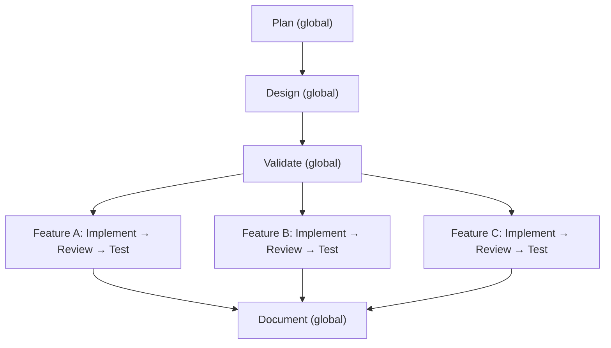

# Relatório de Melhorias — Software Development Agency

**Data:** 2026-02-24
**Escopo:** Análise completa da arquitetura multi-agente, identificação de gargalos de sequencialidade e recomendações para maior assertividade e paralelização.

---

## 1. Diagnóstico: Estado Atual

A agência opera com 5 agentes (PM, PO, TL, Dev, QA) em 7 fases sequenciais, orquestrados manualmente ou via skill `/orchestrator`. O design atual já prevê alguma paralelização intra-fase (assists em paralelo com leads, PM e TL em paralelo no Validate/Document), mas apresenta gargalos significativos entre fases e limitações de assertividade.

### 1.1 Gargalos de Sequencialidade Identificados

**G1 — Pipeline 100% serial entre fases**
O fluxo Plan → Design → Validate → Implement → Review → Test → Document é estritamente sequencial. Se o projeto tem 5 user stories independentes entre si, todas seguem o mesmo pipeline monolítico. Não existe conceito de "fatiar" o trabalho por feature/story e paralelizar pipelines independentes.

**G2 — Implement é um bloco monolítico**
O Dev recebe todas as stories validadas e implementa tudo em sequência numa única sessão. Não há mecanismo para dividir stories entre múltiplas instâncias de Dev trabalhando em paralelo.

**G3 — Review e Test bloqueiam toda a entrega**
Mesmo que story A esteja pronta e story B ainda em implementação, não é possível iniciar review/test de A enquanto B não terminar. Tudo espera o bloco "Implement" concluir.

**G4 — Feedback loops reiniciam fases inteiras**
Se o gate de Review falha, TODO o código volta para Implement — mesmo que o problema seja localizado em 1 de 5 stories. O mesmo vale para Test: uma falha em 1 story bloqueia todas.

**G5 — Assists opcionais mas nunca verificados**
Os agentes assist (haiku) em Plan, Design, Review e Test produzem notas/revisões, mas não há mecanismo para garantir que o lead integre essas notas. O feedback dos assists pode ser silenciosamente ignorado.

### 1.2 Problemas de Assertividade

**A1 — Sem state tracking persistente**
Não existe arquivo de estado que registre quais fases foram concluídas, quais gates passaram, quantas iterações de loop aconteceram. O progresso é inferido pela existência de artefatos — frágil e propenso a erros.

**A2 — Gates não são blocking**
Os hooks atuais são advisory (exit code 0). Nada impede o Dev de rodar `/dev implement` sem que `VALIDATION.md` contenha dois APPROVEDs. A integridade do workflow depende da disciplina humana ou do orchestrator.

**A3 — Sem validação cruzada de artefatos**
Quando o Dev implementa, ele lê ARCHITECTURE.md, mas não há verificação automatizada de que o código produzido realmente corresponde à arquitetura. A checagem é humana (TL review) e acontece tardiamente.

**A4 — Sem métricas de qualidade**
Não há tracking de: tempo por fase, número de iterações de gate, taxa de aprovação, cobertura de testes, complexidade ciclomática. Impossível saber se a agência está melhorando ou piorando.

**A5 — Context loss entre invocações**
Cada agente é "fresh" — sem memória entre sessões. O contexto vem dos documentos markdown, mas decisões de design, trade-offs discutidos e razões de escolhas ficam dispersos ou perdidos.

---

## 2. Recomendações

### 2.1 Paralelização por Feature (Impacto: Alto | Esforço: Alto)

**Problema resolvido:** G1, G2, G3, G4

**Proposta:** Introduzir o conceito de "feature pipeline" — após Plan+Design+Validate (que continuam globais), as fases Implement → Review → Test passam a rodar **por feature/story** em paralelo.



**Implementação:**
1. No backlog, agrupar stories por `feature_area` (já existe no schema).
2. Criar um comando `agency_cli pipeline --phase implement --group-by feature_area` que retorna grupos independentes.
3. O orchestrator spawna um pipeline Dev→TL→QA por grupo, cada um numa branch git separada.
4. Adicionar regra: stories com `dependencies` cross-feature ficam no último grupo (ou grupo "integration").
5. Document roda após todos os pipelines convergirem (merge).

**Pré-requisito:** Análise de dependências entre stories. O `backlog_manager.py` já suporta `--depends`, mas o orchestrator não usa essa informação para paralelizar.

### 2.2 State Machine Persistente (Impacto: Alto | Esforço: Médio)

**Problema resolvido:** A1, A2

**Proposta:** Criar `agent_docs/agency/STATE.json` — arquivo de estado que o orchestrator e os hooks mantêm atualizado.

```json
{
  "project": "my-project",
  "started_at": "2026-02-24T10:00:00Z",
  "current_phase": "implement",
  "phases": {
    "plan": {"status": "completed", "started": "...", "ended": "...", "artifacts": ["docs/PROJECT_BRIEF.md"]},
    "design": {"status": "completed", "artifacts": ["docs/ARCHITECTURE.md"]},
    "validate": {
      "status": "completed",
      "iterations": 1,
      "verdicts": {"pm": "APPROVED", "tl": "APPROVED"}
    },
    "implement": {
      "status": "in_progress",
      "pipelines": {
        "auth": {"stories": ["US-001", "US-002"], "status": "in_progress"},
        "billing": {"stories": ["US-003"], "status": "pending"}
      }
    }
  },
  "metrics": {
    "gate_iterations": {"validate": 1, "review": 0, "test": 0},
    "total_stories": 5,
    "completed_stories": 0
  }
}
```

**Implementação:**
1. Novo comando: `agency_cli state init|update|query`.
2. Cada agente chama `state update` ao iniciar e concluir.
3. Hooks leem `STATE.json` e **bloqueiam** (exit code 1) se pré-condições não forem atendidas.
4. O orchestrator consulta o estado ao iniciar para retomar de onde parou (crash recovery).

### 2.3 Blocking Hooks (Impacto: Alto | Esforço: Baixo)

**Problema resolvido:** A2

**Proposta:** Converter hooks de advisory para blocking. Já existe o `backlog_read_guard.py` — expandir o padrão.

**Hooks prioritários:**
1. `pre_implement_guard` — Bloqueia `/dev implement` se `VALIDATION.md` não contém dual APPROVED.
2. `pre_review_guard` — Bloqueia `/tl review` se não existe código novo em `src/`.
3. `pre_test_guard` — Bloqueia `/qa test` se `REVIEW.md` não indica "no blocking issues".
4. `phase_sequence_guard` — Bloqueia qualquer fase se a anterior não completou (usa STATE.json).

**Implementação:** Cada hook lê `STATE.json` + artefato relevante, retorna exit code 1 + mensagem se condição não for atendida.

### 2.4 Review Incremental por Story (Impacto: Médio | Esforço: Médio)

**Problema resolvido:** G3, G4

**Proposta:** Permitir review e test por story individual, não apenas por fase completa.

**Mudanças:**
1. Dev marca cada story como "In Review" individualmente ao terminar (já faz isso).
2. O TL pode iniciar review de stories em "In Review" enquanto Dev ainda implementa outras.
3. O QA pode testar stories que passaram no review enquanto outras ainda estão em review.
4. O gate de "Test" só bloqueia para Document quando ALL stories estão em "Done".

**Implementação:**
1. O orchestrator monitora o backlog status e spawna TL/QA assim que há stories prontas.
2. Novo comando: `agency_cli backlog ready-for --phase review` retorna stories com status "In Review".
3. O pipeline por story fica: `Dev(story) → TL review(story) → QA test(story)` — cada transição é individual.

### 2.5 Checklist de Integração de Feedback dos Assists (Impacto: Médio | Esforço: Baixo)

**Problema resolvido:** A5, G5

**Proposta:** Quando assists produzem feedback, o lead deve gerar uma seção explícita no artefato final mostrando como cada ponto foi tratado (incorporado, rejeitado com razão, ou adiado).

**Implementação:**
1. Cada skill de lead recebe instrução: "Ao final, adicione '## Feedback Integration' listando cada ponto dos assists e a disposição."
2. O orchestrator valida que essa seção existe antes de marcar a fase como concluída.
3. Template: `| Fonte | Feedback | Disposição | Razão |`

### 2.6 Decision Log (Impacto: Médio | Esforço: Baixo)

**Problema resolvido:** A5

**Proposta:** Criar `docs/DECISIONS.md` — log append-only de decisões de design e trade-offs. Cada agente que toma ou influencia uma decisão adiciona uma entrada.

**Formato:**
```markdown
## DEC-001: Usar PostgreSQL ao invés de MongoDB
- **Fase:** Design
- **Agente:** TL
- **Contexto:** Dados altamente relacionais com necessidade de transações ACID
- **Alternativas consideradas:** MongoDB (descartado por falta de joins nativos), SQLite (descartado por limitação de concorrência)
- **Impacto:** Afeta stories US-001, US-003, US-005
```

**Implementação:** Novo comando `agency_cli decision add --phase design --agent tl --title "..." --context "..." --alternatives "..."` que faz append no arquivo.

### 2.7 Métricas e Observabilidade (Impacto: Médio | Esforço: Médio)

**Problema resolvido:** A4

**Proposta:** Adicionar coleta de métricas ao STATE.json e um comando de report.

**Métricas prioritárias:**
- Tempo por fase (start/end timestamp)
- Iterações por gate (já parcialmente no orchestrator, mas não persistido)
- Stories por status ao longo do tempo
- Tokens consumidos por agente/fase (o `tokens.py` já existe — integrar com state)

**Implementação:**
1. `agency_cli state update` registra timestamps automaticamente.
2. `agency_cli report metrics` gera um resumo.
3. Ao final do ciclo, o orchestrator inclui métricas no relatório final.

### 2.8 Implementação Multi-Dev em Paralelo (Impacto: Alto | Esforço: Médio)

**Problema resolvido:** G2

**Proposta:** Permitir múltiplas instâncias de Dev trabalhando em paralelo, cada uma em um subset de stories sem dependências entre si.

**Implementação:**
1. `agency_cli agent order --phase implement --parallel` analisa dependências e retorna waves:
   ```json
   [
     {"wave": 1, "groups": [
       {"stories": ["US-001", "US-002"], "branch": "feat/auth"},
       {"stories": ["US-003"], "branch": "feat/billing"}
     ]},
     {"wave": 2, "groups": [
       {"stories": ["US-004", "US-005"], "branch": "feat/integration", "depends_on": ["feat/auth", "feat/billing"]}
     ]}
   ]
   ```
2. Wave 1 spawna N instâncias de Dev em paralelo.
3. Wave 2 só inicia quando wave 1 completa e as branches são mergeadas.
4. Cada Dev trabalha numa branch isolada — evita conflitos.

### 2.9 Early Validation Hooks (Impacto: Médio | Esforço: Baixo)

**Problema resolvido:** A3

**Proposta:** Adicionar validações automatizadas durante o Implement que detectam desvios cedo, antes do review humano.

**Exemplos:**
1. **Architecture drift detection:** Script que compara endpoints definidos em ARCHITECTURE.md com os realmente implementados em `src/`.
2. **Convention checker:** Script que valida naming conventions, folder structure, e padrões proibidos listados em CLAUDE.md.
3. **Missing AC coverage:** Script que cruza stories "In Review" com código e verifica se todas as ACs têm algum ponto de implementação referenciado.

**Implementação:** Hooks pós-implement ou um agente "linter" leve (haiku) que roda automaticamente.

---

## 3. Matriz de Priorização

| # | Recomendação | Impacto | Esforço | Prioridade |
|---|-------------|---------|---------|------------|
| 2.3 | Blocking Hooks | Alto | Baixo | P0 |
| 2.2 | State Machine Persistente | Alto | Médio | P0 |
| 2.5 | Checklist de Feedback | Médio | Baixo | P1 |
| 2.6 | Decision Log | Médio | Baixo | P1 |
| 2.4 | Review Incremental por Story | Médio | Médio | P1 |
| 2.9 | Early Validation Hooks | Médio | Baixo | P1 |
| 2.1 | Paralelização por Feature | Alto | Alto | P2 |
| 2.8 | Multi-Dev Paralelo | Alto | Médio | P2 |
| 2.7 | Métricas e Observabilidade | Médio | Médio | P2 |

**Legenda:** P0 = Implementar agora (quick wins de alto impacto). P1 = Próxima iteração. P2 = Roadmap.

---

## 4. Ordem de Implementação Sugerida

**Sprint 1 (Fundação):**
1. State Machine (2.2) — base para tudo que vem depois
2. Blocking Hooks (2.3) — usa o state para enforcement

**Sprint 2 (Qualidade):**
3. Decision Log (2.6) — simples, melhora muito o contexto
4. Checklist de Feedback (2.5) — garante que assists não são ignorados
5. Early Validation Hooks (2.9) — catch errors cedo

**Sprint 3 (Paralelização):**
6. Review Incremental por Story (2.4) — desbloqueia paralelismo intra-fase
7. Multi-Dev Paralelo (2.8) — escala o implement
8. Paralelização por Feature (2.1) — pipelines completos em paralelo

**Sprint 4 (Observabilidade):**
9. Métricas (2.7) — medir para melhorar

---

## 5. Resumo Executivo

A agência atual tem uma base sólida: agentes bem definidos com constraints claros, artifacts padronizados, e um orchestrator funcional. Os principais gargalos são a sequencialidade forçada entre fases (mesmo para stories independentes) e a falta de enforcement automatizado das regras do workflow.

As melhorias de maior impacto com menor esforço são o **State Machine persistente** e os **Blocking Hooks** — juntos, eles transformam a agência de um workflow "confiança no operador" para um sistema que garante suas próprias invariantes. A partir dessa fundação, a paralelização por feature e multi-dev se torna viável e segura.
