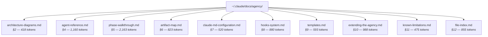

# Progressive Disclosure Analysis

**Target:** `~/.claude/README_AGENCY.md`
**Type:** Standalone documentation file (agency hand-off reference)
**Scanned at:** 2026-02-02
**Total file tokens:** ~9,215
**Total file lines:** 651

## Token Budget Summary

| Section | Lines | Tokens | % of Total | Status |
|---------|-------|--------|-----------|--------|
| Title + Intro | 4 | 68 | 0.7% | OK |
| Table of Contents | 16 | 167 | 1.8% | OK |
| 1. Agency Overview | 15 | 300 | 3.3% | OK (section candidate) |
| 2. Architecture Diagrams | 48 | 418 | 4.5% | OK (section candidate) |
| 3. Role-Phase Matrix | 17 | 230 | 2.5% | OK |
| **4. Agent Reference** | **75** | **1,160** | **12.6%** | **RECOMMENDED** |
| **5. Phase Walkthrough** | **142** | **2,163** | **23.5%** | **MANDATORY** |
| 6. Artifact Map | 70 | 823 | 8.9% | RECOMMENDED |
| 7. CLAUDE.md Configuration | 27 | 520 | 5.6% | CANDIDATE |
| 8. Hooks System | 74 | 880 | 9.6% | RECOMMENDED |
| 9. Templates | 19 | 593 | 6.4% | CANDIDATE |
| 10. Extending the Agency | 72 | 988 | 10.7% | RECOMMENDED |
| 11. Known Limitations | 25 | 475 | 5.2% | OK (section candidate) |
| 12. File Index | 34 | 855 | 9.3% | RECOMMENDED |
| **Total** | **651** | **~9,215** | **100%** | **MANDATORY** |

## Startup Cost

This file is **not loaded at session startup** — it is a reference document that agents or users load on demand. However, when loaded, the entire 9,215-token file enters context regardless of which section is needed.

**Effective load cost per access:** 9,215 tokens (entire file, every time).

## Fragmentation Candidates

### Priority 1: Mandatory (>2000 tokens)

| Section | Tokens | Extractable Sub-sections |
|---------|--------|--------------------------|
| **Entire file** | 9,215 | The file as a whole far exceeds 2,000 tokens. Must be fragmented. |
| 5. Phase Walkthrough | 2,163 | 7 independent phase descriptions (Phase 1 through Phase 7), each 15-24 lines |

### Priority 2: Recommended (>1000 tokens)

| Section | Tokens | Extractable Sub-sections |
|---------|--------|--------------------------|
| 4. Agent Reference | 1,160 | 5 independent agent cards (PM, PO, TL, Dev, QA), each ~13-17 lines |

### Priority 3: Recommended (500-1000 tokens)

| Section | Tokens | Extractable Sub-sections |
|---------|--------|--------------------------|
| 10. Extending the Agency | 988 | Adding Agent (5 steps), Adding Phase (5 steps), Adding Artifact (3 steps), Utility Skills, Key Modification Points, Conventions |
| 8. Hooks System | 880 | Current Hooks, Configuration Format, Event Types, Matcher Syntax, Stdin/Stdout Protocol, Extending Hooks |
| 12. File Index | 855 | Single table — keep intact but extract to separate file |
| 6. Artifact Map | 823 | Two directory trees (project-level + agency-level) |
| 9. Templates | 593 | Template table + how agents consume them |
| 7. CLAUDE.md Configuration | 520 | Sections description + how agents consume |

### Code Blocks

| Section | Code Lines | Type | Action |
|---------|-----------|------|--------|
| 6. Artifact Map | 61 | Directory tree (text) | No extraction needed (illustrative, not executable) |
| 8. Hooks System | 32 | JSON configuration examples | Candidate for extraction if hooks section is fragmented |
| 2. Architecture Diagrams | 32 | Mermaid diagrams | Keep with their descriptions |

## Duplicate Content

| Content | Found in | Est. Tokens | Recommendation |
|---------|----------|-------------|---------------|
| Agent identity (role, hierarchy, constraints) | README_AGENCY.md §4 + each SKILL.md | 315 | Keep in SKILL.md (authoritative), remove or summarize in README |
| Phase workflows (step-by-step, inputs, outputs) | README_AGENCY.md §5 + each SKILL.md | 1,368 | Keep in SKILL.md (authoritative for execution), reduce README to summary |
| Hierarchy & hard constraints | README_AGENCY.md §2/§4 + each SKILL.md | 875 | Keep in SKILL.md, link from README |
| Artifact lists | README_AGENCY.md §6 + each SKILL.md outputs | 350 | Keep in README §6 (authoritative map), SKILL.md lists are contextual |
| Project Root Resolution | All 5 SKILL.md files (identical block) | 565 | Extract to shared reference, include in each SKILL.md |
| Phase Routing boilerplate | All 5 SKILL.md files (identical block) | 165 | Extract to shared reference |
| Overview + phase commands + artifact structure | README_AGENCY.md + USAGE_GUIDE.md | 625 | USAGE_GUIDE should be a quick-reference stub, not a copy |

**Total estimated duplication:** ~4,263 tokens across all files.

## Projected Savings

If README_AGENCY.md is fragmented into a hub document with on-demand reference files:

| Metric | Before | After (projected) | Reduction |
|--------|--------|-------------------|-----------|
| Tokens loaded per access | 9,215 | ~800 (hub only) | ~91% |
| Sections loaded per typical query | 12 | 1-2 | ~85% |
| Cross-file duplication | ~4,263 tokens | ~1,000 tokens | ~77% |

## Top 3 Recommendations

### 1. Fragment into hub + reference files

Split README_AGENCY.md into a lightweight hub (~800 tokens) with an index table, and extract each major section into `~/.claude/docs/agency/` as standalone reference files. The hub retains: title, overview (condensed), role-phase matrix, and an index table pointing to each reference file with "when to load" triggers.

**Suggested structure:**

### 2. Deduplicate README vs SKILL.md content

Sections 4 (Agent Reference) and 5 (Phase Walkthrough) in README duplicate ~2,558 tokens already present in the authoritative SKILL.md files. Reduce README's agent and phase sections to summary tables with one-line descriptions, linking to SKILL.md files for full details. This saves ~1,500 tokens from the README and eliminates a maintenance burden (two places to update).

### 3. Consolidate USAGE_GUIDE.md

USAGE_GUIDE.md duplicates ~625 tokens from README_AGENCY.md. After fragmentation, USAGE_GUIDE should become a quick-reference card (~300 tokens) with command tables only, referencing the hub for detailed walkthroughs. Alternatively, merge USAGE_GUIDE content into the hub's index and retire the separate file.
