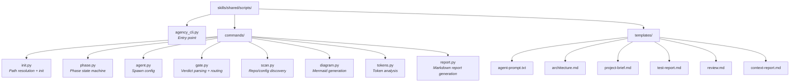

# Relatório: Scriptificação de Operações Determinísticas

> **Objetivo:** Identificar operações que hoje consomem tokens do LLM mas seguem regras fixas e poderiam ser scripts determinísticos.

---

## Resumo Executivo

Foram identificadas **79 operações determinísticas** distribuídas em 3 categorias:

| Categoria | Operações | Tokens Estimados/Execução | Prioridade |
|-----------|-----------|---------------------------|------------|
| **A. Orchestrator & Agentes** | 12 | ~8.000–15.000 tokens/fase | Alta |
| **B. Backlog Skill** | 12 | ~2.000–4.000 tokens/chamada | Média (já parcialmente scriptado) |
| **C. Utility Skills** | 55 | ~10.000–25.000 tokens/execução | Alta |

**Economia estimada:** 40–60% dos tokens gastos em execução de workflows podem ser eliminados com um CLI unificado.

---

## Proposta: `agency_cli.py` — CLI Unificado da Agência

Um único script Python que centraliza todas as operações determinísticas, invocável via Bash por qualquer agente ou pelo orchestrator.

### Estrutura proposta



---

## A. Orchestrator & Agentes — 12 Operações

### A1. Resolução de Paths (Prioridade: CRÍTICA)

**Hoje:** O LLM executa Glob para encontrar `CLAUDE.md`, depois faz string manipulation para derivar `PROJECT_ROOT`, `SCRIPT_PATH`, `BACKLOG_PATH` e `TEAM_NAME`. Cada agente spawned repete isso se o orchestrator não pré-resolver.

**Script:**
```bash
agency_cli init --scan-root /path/to/workspace
# Output JSON:
# {
#   "project_root": "/path/to/workspace/unit/project",
#   "script_path": "/path/to/.../backlog_manager.py",
#   "backlog_path": "/path/to/.../backlog.json",
#   "team_name": "agency-project",
#   "claude_md": "/path/to/.../CLAUDE.md"
# }
```

**Economia:** ~500 tokens/agente × 5 agentes = ~2.500 tokens/fase eliminados.

### A2. Lookup de Modelo por Agente (Prioridade: ALTA)

**Hoje:** O LLM consulta a phase-matrix.md para decidir qual modelo (opus/sonnet/haiku) usar para cada agente em cada fase.

**Script:**
```bash
agency_cli agent model --role dev --phase implement
# Output: "sonnet"

agency_cli agent model --role tl --phase review
# Output: "opus"

agency_cli agent list --phase design
# Output JSON:
# [
#   {"role": "tl", "name": "tl-design", "model": "opus", "type": "lead"},
#   {"role": "dev", "name": "dev-design-assist", "model": "haiku", "type": "assist"},
#   {"role": "qa", "name": "qa-design-assist", "model": "haiku", "type": "assist"}
# ]
```

**Economia:** Elimina leitura de phase-matrix.md (~1.200 tokens) em cada spawning.

### A3. Geração de Prompt de Agente (Prioridade: ALTA)

**Hoje:** O orchestrator monta o prompt do agente via LLM, preenchendo template com variáveis.

**Script:**
```bash
agency_cli agent prompt --role dev --phase implement \
  --project-root /path --script-path /path/bm.py \
  --backlog-path /path/backlog.json --objective "Build auth module"
# Output: prompt completo pronto para usar no Task tool
```

**Economia:** ~800 tokens de raciocínio do LLM para montar cada prompt.

### A4. State Machine de Fases (Prioridade: ALTA)

**Hoje:** O LLM decide a próxima fase lendo phase-details.md e avaliando condições.

**Script:**
```bash
agency_cli phase next --current validate --verdict "APPROVED,APPROVED"
# Output: "implement"

agency_cli phase next --current review --verdict "FAIL"
# Output: "implement"  (loop back)

agency_cli phase next --current test --verdict "FAIL_BUG"
# Output: "implement"  (regression)

agency_cli phase sequence
# Output: ["plan","design","validate","implement","review","test","document"]
```

**Economia:** Elimina leitura de phase-details.md + raciocínio condicional (~2.000 tokens/gate).

### A5. Parsing de Verdicts de Gates (Prioridade: ALTA)

**Hoje:** O LLM lê o output do agente e interpreta se contém `[VERDICT:APPROVED]`, `[GATE:PASS]`, etc.

**Script:**
```bash
agency_cli gate parse --file docs/VALIDATION.md
# Output: {"pm": "APPROVED", "tl": "APPROVED", "combined": "APPROVED"}

agency_cli gate parse --file docs/REVIEW.md
# Output: {"verdict": "FAIL", "blocking_issues": 3}

agency_cli gate parse --text "$(cat agent_output.txt)" --phase test
# Output: {"verdict": "PASS"}
```

**Economia:** ~500 tokens de parsing por gate × 3 gates = ~1.500 tokens/ciclo.

### A6. Transição de Status em Batch (Prioridade: MÉDIA)

**Hoje:** O LLM chama `backlog_manager.py status` individualmente para cada story, decidindo quando renderizar.

**Script:**
```bash
agency_cli backlog transition --phase implement --status "In Progress" \
  --caller dev --backlog-path /path/backlog.json --script-path /path/bm.py
# Automaticamente: lista stories no status anterior correto, transiciona todas, render uma vez
```

**Economia:** Elimina decisão de quais stories transicionar + batch render (~1.000 tokens/transição).

### A7–A12. Outras operações menores

| # | Operação | Script Command | Economia |
|---|----------|----------------|----------|
| A7 | Team name derivation | `agency_cli init` (incluído em A1) | — |
| A8 | Agent naming convention | `agency_cli agent name --role qa --phase test --type assist` | ~100 tok |
| A9 | Artifact path resolution | `agency_cli phase artifacts --phase review --project-root /path` | ~200 tok |
| A10 | Permission validation | Já no `backlog_manager.py` | — |
| A11 | Render batching | `agency_cli backlog transition` (incluído em A6) | — |
| A12 | Dependency ordering | `agency_cli agent order --phase design` → JSON com ordem | ~300 tok |

---

## B. Backlog Skill — Já Parcialmente Scriptado

O `backlog_manager.py` já é um script. O que falta:

### B1. Resolução de Script Path (duplicada em A1)

Já coberto por `agency_cli init`.

### B2. Wrapper de Conveniência para Workflows Comuns

**Hoje:** O LLM monta sequências de comandos (next-id → create → create → render).

**Script:**
```bash
agency_cli backlog batch-create --backlog-path /path/backlog.json \
  --caller po --input stories.json
# Lê JSON com array de stories, executa next-id + create para cada, render uma vez no final

agency_cli backlog phase-transition --phase validate --caller tl \
  --backlog-path /path/backlog.json
# Lista stories em "In Design", transiciona todas para "Validated", render uma vez
```

### B3. Status Transition Validation

**Hoje:** O LLM sabe que `Ready → In Design` é válido mas `Ready → In Testing` não.

**Script:**
```bash
agency_cli backlog validate-transition --from "Ready" --to "In Testing"
# Output: {"valid": false, "allowed_targets": ["In Design"]}
```

---

## C. Utility Skills — 55 Operações

### C1. repo-map: Discovery e Catalogação (13 ops)

**Hoje:** O LLM faz Glob/Read extensivo para descobrir repos, parsear configs, extrair endpoints, gerar diagramas. Tudo determinístico.

**Script:**
```bash
agency_cli scan repo --root /path/to/project
# Output JSON com:
# - repos encontrados (markers: .git, .sln, package.json, etc.)
# - stack detectado por repo
# - DB configs (redacted)
# - API endpoints extraídos
# - Integrações (HTTP clients, message brokers)
# - Environment vars

agency_cli diagram er --input scan-result.json --output docs/diagrams/
agency_cli diagram endpoints --input scan-result.json --output docs/endpoints.md
agency_cli diagram workflow --input scan-result.json --output docs/workflows.md
agency_cli diagram service-map --input scan-result.json --output docs/service-map.md
```

**Economia:** O repo-map hoje consome ~15.000–25.000 tokens por execução (Glob + Read de dezenas de arquivos + raciocínio para parsear). O script faria tudo em <1 segundo.

### C2. project-map: Orquestração Multi-Repo (14 ops)

**Hoje:** O LLM descobre repos, lança Tasks em batch, monitora conclusão, coleta JSONs, faz cross-reference, gera docs.

**Script:**
```bash
agency_cli scan project --root /path/to/workspace --batch-size 8
# Fase 1: discovery (determinístico)
# Fase 2: gera configs de Task para cada repo (determinístico)
# Fase 3: coleta e valida resultados (determinístico)
# Fase 4: cross-reference analysis (determinístico)
# Fase 5: gera documentação (determinístico)

# Apenas a execução dos Tasks (repo-map por repo) precisa do LLM
```

**Economia:** ~5.000–10.000 tokens de orquestração eliminados. O LLM só faz o repo-map de cada repo individual.

### C3. apply-progressive-disclosure: Análise de Tokens (23 ops)

**Hoje:** O LLM escaneia arquivos, conta tokens, identifica candidatos, fragmenta, deduplica, gera relatório. Tudo baseado em regras fixas.

**Script:**
```bash
agency_cli tokens analyze --root /path/to/project
# Output JSON: arquivo → tokens, startup cost, candidates, duplicates

agency_cli tokens fragment --file CLAUDE.md --threshold 300 --output-dir agent_docs/
# Extrai seções > threshold para arquivos separados

agency_cli tokens fragment-skill --file SKILL.md --threshold 300 --output-dir references/
# Mesmo para skills

agency_cli tokens deduplicate --root /path/to/project
# Identifica e reporta duplicatas

agency_cli tokens report --analysis analysis.json --migration migration.json \
  --output docs/CONTEXT_REPORT.md
# Gera relatório before/after
```

**Economia:** O apply-pd hoje consome ~10.000–20.000 tokens por execução. O script faria análise + fragmentação + report em <5 segundos.

### C4. api-doc-scraper: Scraping e Geração (5 ops)

**Hoje:** O LLM faz web fetch, extrai links, invoca scraping script, gera skill.

**Script:**
```bash
agency_cli scrape api-docs --url https://api.example.com/docs \
  --output-dir skills/example-api/
# Fase 1: discovery (determinístico - link extraction)
# Fase 2: scraping (já é script)
# Fase 3: geração de skill (PARCIALMENTE determinístico - template + preenchimento)
# Fase 4: cleanup (determinístico)
```

**Nota:** A Fase 3 (skill generation) tem componente não-determinístico — o LLM precisa interpretar o corpus e decidir como organizar a skill. Mas o scaffolding (criar diretório, frontmatter, references/) é determinístico.

---

## Roadmap de Implementação

### Fase 1: Core CLI (Impacto imediato, ~2 dias)

Implementar `agency_cli.py` com os módulos:

1. **`init`** — Resolução de paths (A1)
2. **`phase`** — State machine + sequencing (A4)
3. **`gate`** — Parsing de verdicts (A5)
4. **`agent`** — Model lookup + naming + prompt generation (A2, A3, A8, A12)

**Economia estimada:** ~5.000–8.000 tokens/fase × 7 fases = ~35.000–56.000 tokens/ciclo completo.

### Fase 2: Backlog Wrappers (~1 dia)

5. **`backlog`** — Batch operations + transition validation (A6, B2, B3)

**Economia estimada:** ~2.000–4.000 tokens/fase com transições.

### Fase 3: Scanning & Diagrams (~3 dias)

6. **`scan`** — Repo/project discovery + config parsing (C1, C2)
7. **`diagram`** — Mermaid generation (C1, C2)

**Economia estimada:** ~15.000–25.000 tokens/execução de repo-map ou project-map.

### Fase 4: Token Analysis (~2 dias)

8. **`tokens`** — Análise, fragmentação, deduplicação (C3)

**Economia estimada:** ~10.000–20.000 tokens/execução de apply-pd.

### Fase 5: Templates & Reports (~1 dia)

9. **`report`** — Geração de markdown reports (transversal)
10. **`template`** — Scaffolding de docs (PROJECT_BRIEF, ARCHITECTURE, etc.)

---

## Impacto Total Estimado

| Cenário | Tokens Hoje | Tokens Com Scripts | Redução |
|---------|-------------|--------------------|---------|
| Ciclo completo (7 fases) | ~150.000–250.000 | ~80.000–140.000 | ~40–45% |
| repo-map (1 repo) | ~15.000–25.000 | ~3.000–5.000 | ~75–80% |
| project-map (5 repos) | ~40.000–60.000 | ~15.000–25.000 | ~55–60% |
| apply-pd (1 projeto) | ~10.000–20.000 | ~2.000–4.000 | ~75–80% |

**O LLM fica livre para focar em:** elicitação de requisitos, decisões de design, review de código, escrita de testes criativos, interpretação de resultados — tarefas onde o julgamento humano-like agrega valor.

---

## Princípio Arquitetural

> **Regra de ouro:** Se a operação pode ser descrita como `if/else`, `for loop`, `regex match`, `string format`, ou `file I/O` — ela é um script, não uma tarefa de LLM.

O LLM deve apenas:
1. **Decidir** (qual abordagem seguir quando há ambiguidade)
2. **Criar** (gerar código, texto, arquitetura original)
3. **Avaliar** (julgar qualidade, identificar problemas não-óbvios)
4. **Comunicar** (formular perguntas, explicar decisões)
