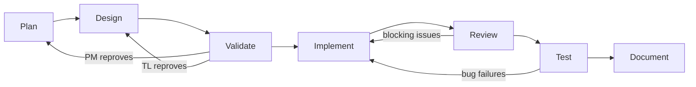
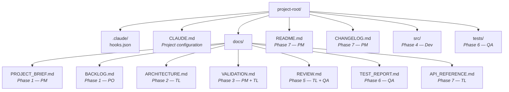
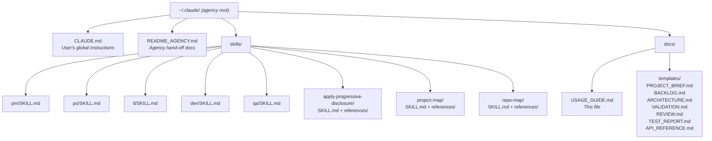

# Software Development Agency — Usage Guide

## Overview

This agency implements a multi-agent SDLC workflow with 5 role-based agents that participate across 7 phases. Each agent is a Claude Code skill invoked with a phase argument. All agency files (skills, templates, documentation) live in `~/.claude/`.

## Agents

| Command | Role | Client Interaction |
|---------|------|-------------------|
| `/pm` | Product Manager | Heavy |
| `/po` | Product Owner | Heavy |
| `/tl` | Tech Lead | Low |
| `/dev` | Developer Specialist | None |
| `/qa` | QA Specialist | None |

## Full Workflow

Run the phases in order. Each command invokes the agent in the specified phase mode.

### Phase 1: Plan

```
/pm plan       → Produces docs/PROJECT_BRIEF.md (leads)
/po plan       → Produces docs/BACKLOG.md (assists PM, produces backlog)
/tl plan       → Adds technical risk assessment to brief (assists)
/dev plan      → Adds specialist notes to brief (assists)
/qa plan       → Adds testability notes to brief (assists)
```

**Start with** `/pm plan`. The PM gathers requirements and produces the brief. Then run `/po plan` to break objectives into user stories. Optionally run `/tl plan`, `/dev plan`, `/qa plan` for specialist input.

### Phase 2: Design

```
/tl design     → Produces docs/ARCHITECTURE.md (leads)
/dev design    → Reviews architecture for implementability (assists)
/qa design     → Reviews architecture for testability (assists)
```

**Start with** `/tl design`. The Tech Lead produces the architecture document. Optionally run `/dev design` and `/qa design` for review feedback.

### Phase 3: Validate (Dual Gate)

```
/pm validate   → Business validation in docs/VALIDATION.md (leads business)
/po validate   → Business rule compliance review (assists)
/tl validate   → Technical validation in docs/VALIDATION.md (leads technical)
```

**Run both** `/pm validate` and `/tl validate`. Both must APPROVE to proceed.

| Outcome | Action |
|---------|--------|
| PM reproves | Go back to `/pm plan` |
| TL reproves | Go back to `/tl design` |
| Both approve | Proceed to `/dev implement` |

### Phase 4: Implement

```
/dev implement → Produces source code in src/ (leads)
/tl implement  → Available for technical guidance (assists)
```

**Start with** `/dev implement`. The Developer writes production code. Use `/tl implement` if you need the Tech Lead to answer questions or review decisions during implementation.

### Phase 5: Review

```
/tl review     → Produces docs/REVIEW.md (leads)
/qa review     → Adds QA section to docs/REVIEW.md (assists)
```

**Start with** `/tl review`, then `/qa review`.

| Outcome | Action |
|---------|--------|
| Blocking issues found | Go back to `/dev implement` to fix, then re-review |
| No blocking issues | Proceed to `/qa test` |

### Phase 6: Test

```
/qa test       → Produces tests/ + docs/TEST_REPORT.md (leads)
/tl test       → Reviews test coverage (assists)
```

**Start with** `/qa test`. The QA Specialist writes and executes tests.

| Outcome | Action |
|---------|--------|
| Test failures (bugs) | Go back to `/dev implement` to fix, then `/qa test` |
| All pass | Proceed to documentation |

### Phase 7: Document

```
/pm document   → Produces README.md, CHANGELOG.md (leads business)
/tl document   → Produces docs/API_REFERENCE.md, updates ARCHITECTURE.md (leads technical)
/po document   → Reviews business docs for accuracy (assists)
/dev document  → Adds inline code documentation (assists)
/qa document   → Finalizes test documentation (assists)
```

**Run** `/pm document` and `/tl document` first (leads), then assistants as needed.

## Quick Reference

Minimum viable workflow (leads only):

```
/pm plan  →  /po plan  →  /tl design  →  /pm validate  →  /tl validate  →  /dev implement  →  /tl review  →  /qa test  →  /pm document  →  /tl document
```

Full workflow (all participants):

```
Phase 1:  /pm plan → /po plan → /tl plan → /dev plan → /qa plan
Phase 2:  /tl design → /dev design → /qa design
Phase 3:  /pm validate → /po validate → /tl validate
Phase 4:  /dev implement  (+ /tl implement for guidance)
Phase 5:  /tl review → /qa review
Phase 6:  /qa test → /tl test
Phase 7:  /pm document → /tl document → /po document → /dev document → /qa document
```

## Feedback Loops

The workflow supports iterative refinement:



## Utility Skills

Standalone tools available at any point in the workflow.

### Context Optimization

```
/apply-progressive-disclosure analyze          → Token budget report in docs/CONTEXT_ANALYSIS.md
/apply-progressive-disclosure optimize         → Apply fragmentation and restructuring
/apply-progressive-disclosure optimize --dry-run → Preview changes without writing
/apply-progressive-disclosure report           → Before/after comparison in docs/CONTEXT_REPORT.md
```

**Recommended workflow:** Run `analyze` first to see the token budget. Review the report. Run `optimize --dry-run` to preview changes. Then `optimize` to apply. Finally `report` to verify savings.

---

## Customization

### New Project Setup

1. Copy the CLAUDE.md template from `~/.claude/docs/templates/CLAUDE_TEMPLATE.md` to your project root as `CLAUDE.md` and fill in the sections:
   - **Stack:** Your runtime, framework, database, infrastructure
   - **Conventions:** Naming, structure, error handling, logging
   - **Domain Glossary:** Business terms and definitions
   - **Forbidden Patterns:** Anti-patterns to avoid
   - **Agent Overrides:** Per-role adjustments

2. The artifact templates in `~/.claude/docs/templates/` are used automatically by the agent skills. No need to copy them to each project.

3. Hooks (`.claude/hooks.json`) are project-level. Copy from a reference project or create new ones as needed.

### Adapting the Stack

The agency is stack-agnostic. To use a different stack:

1. Update your project's `CLAUDE.md` with your stack details
2. Update `hooks.json` with your linter/formatter/build commands
3. The agents read `CLAUDE.md` and adapt their behavior accordingly

## Project Artifacts



## Agency Files Location

All agency infrastructure lives in the user's global Claude config directory:


