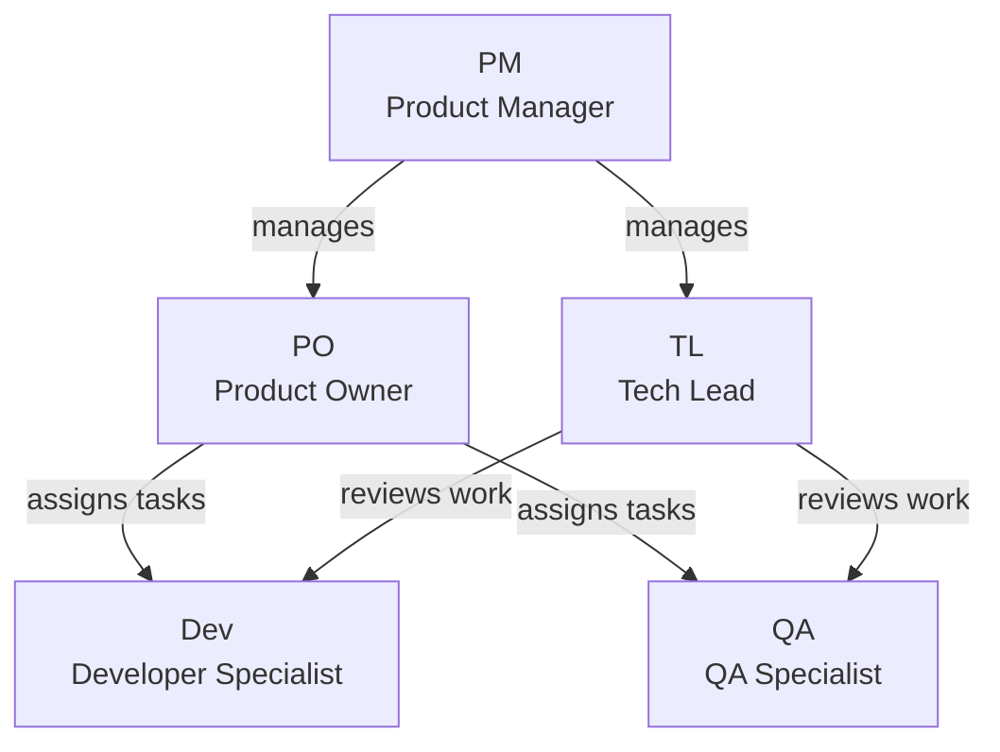
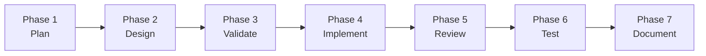
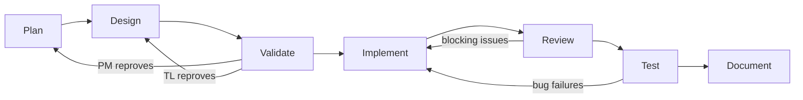

# Architecture Diagrams

Visual representations of the agency's structure and workflow.

## Agent Hierarchy

The PM sits at the top of the management layer, managing both the PO and TL. The PO assigns tasks to Dev and QA. The TL reviews the technical output of Dev and QA.

## Orchestration Flow

## Feedback Loops

Three feedback loops exist. Validation failure routes back to Plan (business) or Design (technical). Blocking issues in Review send the workflow back to Implement. Test failures caused by bugs also return to Implement.
