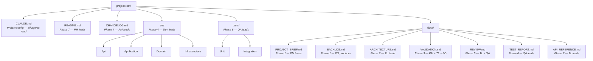
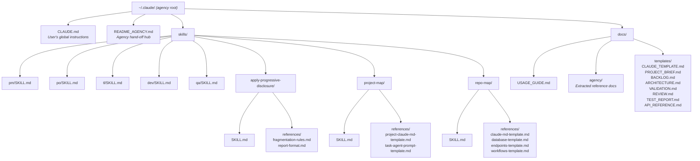

# Artifact Map

Directory structure showing all artifacts produced during the SDLC workflow and the agency's own file layout.

## Project Artifacts (per-project)

## Agency Files (shared across all projects)

Hooks are project-level and live in each project's `.claude/hooks.json`.
