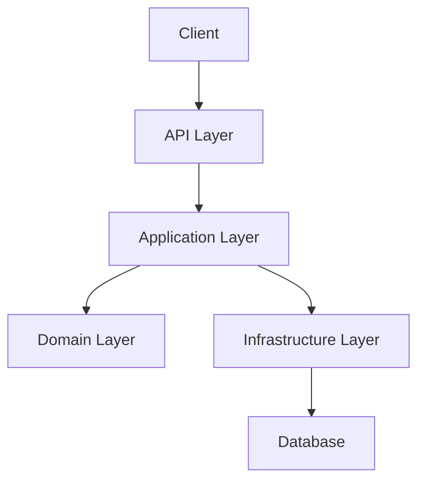
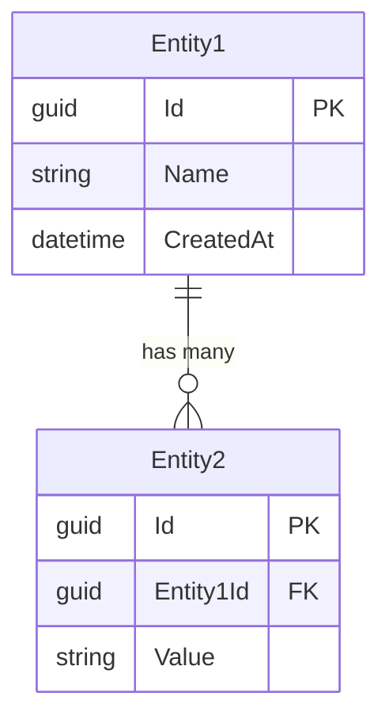
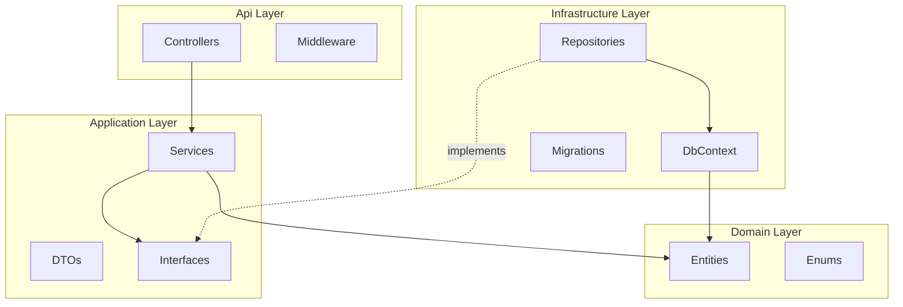
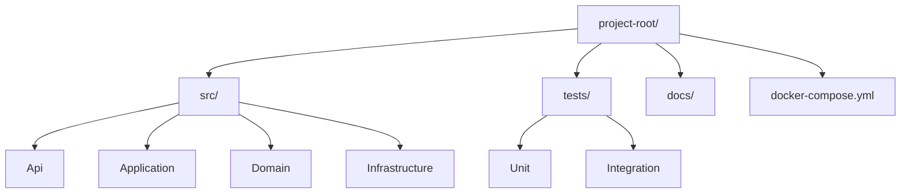

# Architecture

> Phase 2 output — Tech Lead leads, all roles assist.

## System Overview



*High-level description of the system and its purpose.*

## Tech Stack

| Component | Technology | Justification |
|-----------|-----------|---------------|
| Runtime | *e.g., .NET 8* | *Why this choice* |
| Framework | *e.g., ASP.NET Core* | |
| Database | *e.g., PostgreSQL* | |
| ORM | *e.g., EF Core* | |
| Testing | *e.g., xUnit* | |
| Infrastructure | *e.g., Docker* | |

## Data Models



### Entity Definitions

#### Entity1

| Property | Type | Constraints | Description |
|----------|------|------------|-------------|
| Id | Guid | PK, Required | Unique identifier |
| Name | string | Required, MaxLength(100) | *Description* |

## API Contracts

### `GET /api/resource`

**Description:** *What this endpoint does.*

**Response:** `200 OK`
```json
{
  "items": [
    {
      "id": "guid",
      "name": "string"
    }
  ],
  "totalCount": 0
}
```

**Error Responses:**

| Status | Condition |
|--------|----------|
| 400 | Invalid query parameters |
| 500 | Internal server error |

---

### `POST /api/resource`

**Description:** *What this endpoint does.*

**Request Body:**
```json
{
  "name": "string"
}
```

**Response:** `201 Created`
```json
{
  "id": "guid",
  "name": "string"
}
```

**Validation Rules:**
- `name`: Required, 1-100 characters

---

## Component Architecture



## Error Handling Strategy

| Scenario | Approach | HTTP Status |
|----------|----------|-------------|
| Validation failure | Return `ProblemDetails` | 400 |
| Resource not found | Return `ProblemDetails` | 404 |
| Business rule violation | Return `Result<T>` failure, map to `ProblemDetails` | 422 |
| Unexpected error | Log + return generic `ProblemDetails` | 500 |

## Security Considerations

- *Authentication approach*
- *Authorization rules*
- *Input validation strategy*
- *CORS configuration*

## Project Structure


