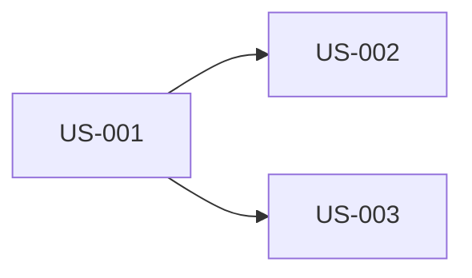

# Product Backlog

> Phase 1 output — Product Owner produces from Project Brief.

## User Stories

### Feature Area: *[Name]*

#### US-001: *[Story Title]*

**Priority:** Must / Should / Could / Won't

> As a *[role]*, I want *[capability]*, so that *[benefit]*.

**Acceptance Criteria:**

- **AC-001.1:** Given *[context]*, when *[action]*, then *[expected result]*
- **AC-001.2:** Given *[context]*, when *[action]*, then *[expected result]*

**Notes:** *Any additional context, edge cases, or business rules.*

---

#### US-002: *[Story Title]*

**Priority:** Must / Should / Could / Won't

> As a *[role]*, I want *[capability]*, so that *[benefit]*.

**Acceptance Criteria:**

- **AC-002.1:** Given *[context]*, when *[action]*, then *[expected result]*

---

### Feature Area: *[Name]*

#### US-003: *[Story Title]*

*...*

---

## Story Dependency Map

## Open Questions

| # | Question | Status | Answer |
|---|---------|--------|--------|
| 1 | *Ambiguous business rule or edge case* | Open / Resolved | *Answer if resolved* |
