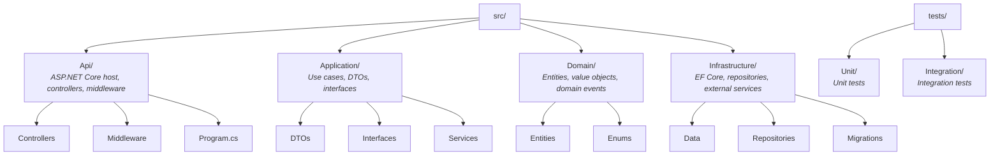

# Project Configuration

> This file configures the Software Development Agency. Customize each section for your project.

## Stack

- **Runtime:** .NET 8
- **Framework:** ASP.NET Core Web API
- **ORM:** Entity Framework Core
- **Database:** PostgreSQL
- **Infrastructure:** Docker, Docker Compose
- **Testing:** xUnit, FluentAssertions, Moq
- **API Documentation:** Swagger / OpenAPI

## Conventions

### Naming

- **C# classes/methods:** PascalCase
- **C# local variables/parameters:** camelCase
- **C# private fields:** _camelCase with underscore prefix
- **Database tables:** PascalCase (singular, matching entity name)
- **API endpoints:** kebab-case, plural nouns (e.g., `/api/products`, `/api/order-items`)

### Project Structure

### Error Handling

- Use `Result<T>` pattern for business operations (no exceptions for expected failures)
- Reserve exceptions for truly exceptional/unexpected situations
- Return structured `ProblemDetails` responses from API (RFC 7807)
- Log all errors with structured logging (Serilog)

### Logging

- Use Serilog with structured logging
- Log levels: `Debug` for development, `Information` for business events, `Warning` for recoverable issues, `Error` for failures
- Include correlation IDs in all log entries

## Domain Glossary

> Define ubiquitous language terms for your business domain here.

| Term | Definition |
|------|-----------|
| *Add your domain terms here* | *Their definitions* |

## Forbidden Patterns

- No static service classes (use dependency injection)
- No business logic in controllers (controllers are thin, delegate to services)
- No direct database access outside the Infrastructure layer
- No `string` for IDs (use strongly-typed IDs or `Guid`)
- No `DateTime.Now` (use `IDateTimeProvider` for testability)
- No hardcoded connection strings or secrets (use configuration/environment variables)

## Agent Overrides

> Per-role adjustments for this specific project.

- **Dev Specialist:** Follow vertical slice when the architecture document specifies it
- **QA Specialist:** Use xUnit with FluentAssertions; integration tests use WebApplicationFactory
- **Tech Lead:** Prefer minimal API style only if project brief specifies it; default to controllers
