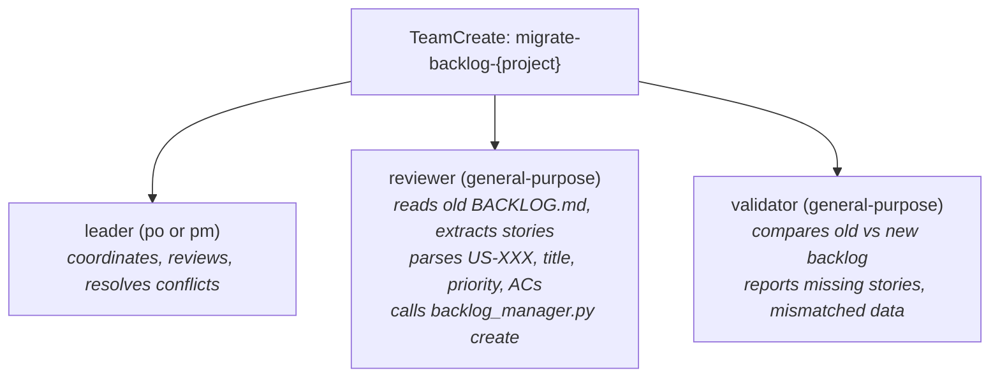

# Migration from Legacy BACKLOG.md

Projects that already have a `docs/BACKLOG.md` (old markdown format) can migrate to the JSON system. The migration spawns a review team to parse the existing file and recreate stories in the new format.

## Migration Workflow

Only PO or PM can trigger migration (they have `create` permission).

1. Verify the legacy file exists at `{project_root}/docs/BACKLOG.md`.
2. Initialize the new backlog: `python {script} init {BACKLOG_PATH}`
3. Spawn a migration review team via `TeamCreate` with name `migrate-backlog-{project}`:

4. The **reviewer** teammate receives this prompt:
   > Read `{project_root}/docs/BACKLOG.md`. For every user story, extract: id, title, role, want, benefit, feature area, priority, acceptance criteria (as JSON array with id/given/when/then), notes, and dependencies. Then call `python {script} create {BACKLOG_PATH}` for each story using `--caller <leader_role>`. Preserve original US-XXX IDs. After all stories are created, mark each as the status that best matches its current state in the old file (default: Ready). Finally call render.

5. The **validator** teammate receives this prompt:
   > Read `{project_root}/docs/BACKLOG.md` (old format) and query `python {script} list {BACKLOG_PATH} --format json` (new format). Compare story count, IDs, titles, acceptance criteria counts, priorities, and dependencies. Report discrepancies as a structured list. Also check the Open Questions table and migrate any questions via `python {script} question {BACKLOG_PATH} --text "..." --caller <leader_role>`.

6. Leader reviews the validator's report, resolves any discrepancies via `edit` commands, and renders final BACKLOG.md.
7. After successful migration, the old `docs/BACKLOG.md` can be deleted or archived by the user.

## Status Mapping for Migration

When migrating stories, infer status from context in the old file:

| Old file indicator | New status |
|-------------------|------------|
| No phase markers / default | Ready |
| Mentioned in ARCHITECTURE.md | In Design |
| Mentioned in VALIDATION.md as approved | Validated |
| Has implementation in src/ | In Progress or In Review |
| Has tests passing | Done |

If status cannot be determined, default to `Ready`.
