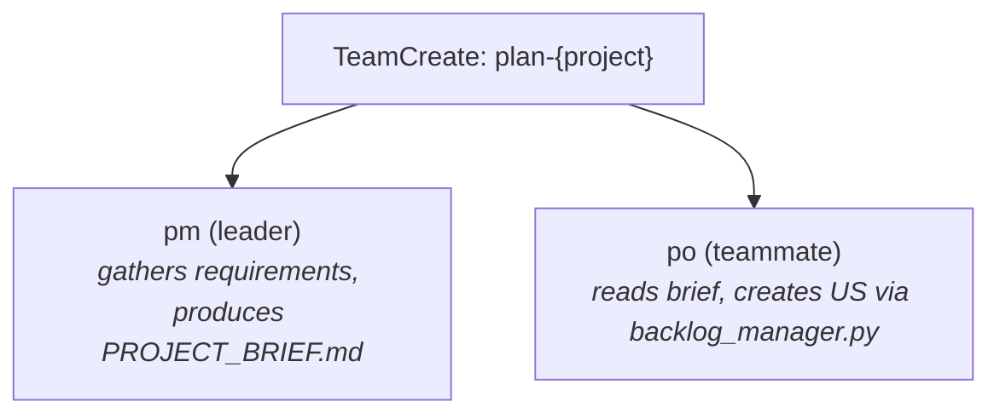
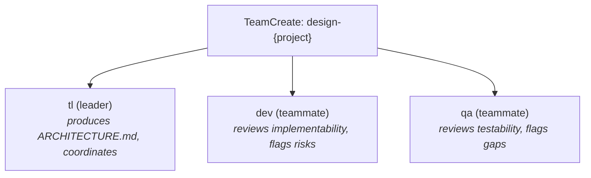
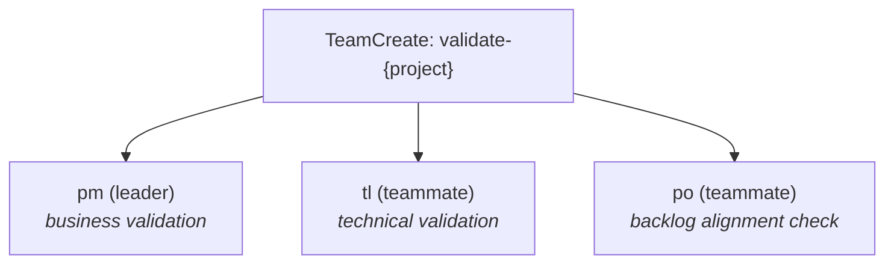
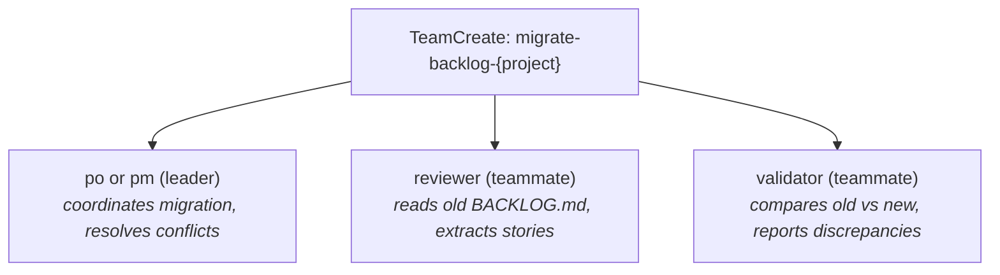

# Team Orchestration Patterns

How agent skills (pm, po, tl) use TeamCreate and Task tools to parallelize backlog-driven work.

## When to Spawn Teams

Agents decide based on workload:

- **Single story / simple task**: Process directly, no team needed.
- **Multiple stories in same phase**: Spawn a team. Each teammate handles a subset of stories.
- **Cross-cutting design/validation**: Spawn a team with specialized agents (dev for implementability, qa for testability).

## Team Patterns by Phase

### Plan Phase (PM leads, PO assists)

PM spawns PO as a teammate to break down objectives into user stories while PM continues gathering requirements.

PO uses `backlog_manager.py create` for each user story. PM reviews the backlog summary when PO finishes.

### Design Phase (TL leads, Dev + QA assist)

TL spawns dev and qa as teammates to review stories in parallel.

Each teammate reads stories via `backlog_manager.py list --status Ready` and provides feedback. TL updates story statuses to "In Design" as they are processed.

### Validate Phase (PM + TL co-lead)

PM and TL can spawn teammates to validate different aspects in parallel.

Each validates against the backlog and updates VALIDATION.md with their section.

### Migration (PO or PM leads)

When a project has an existing `docs/BACKLOG.md` in the old markdown format, spawn a migration review team to convert it to the JSON system.

**Reviewer task:** Parse the legacy markdown for US-XXX stories, extracting structured fields (title, role/want/benefit, priority, acceptance criteria, notes, dependencies, feature area). Call `backlog_manager.py create` for each. Preserve original IDs. Migrate open questions via `backlog_manager.py question`.

**Validator task:** After reviewer finishes, run `backlog_manager.py list --format json` and compare against the old file. Report: missing stories, mismatched priorities, lost acceptance criteria, unresolved questions. Produce a structured discrepancy report.

**Leader:** Review the validator's report, fix discrepancies via `backlog_manager.py edit`, render final BACKLOG.md. Inform the user that the old `docs/BACKLOG.md` can be archived.

## Backlog Status Transitions by Phase

| Phase     | Agent  | Status Transition               |
|-----------|--------|--------------------------------|
| Plan      | PO     | → Draft → Ready                |
| Design    | TL     | Ready → In Design              |
| Validate  | PM/TL  | In Design → Validated          |
| Implement | Dev    | Validated → In Progress → In Review |
| Review    | TL     | In Review (stays or → In Progress if issues) |
| Test      | QA     | In Review → In Testing → Done  |

## Task Tool Integration

When a team leader assigns work to teammates, use the Task tools:

1. `TaskCreate` — create a task per user story or group of stories
2. `TaskUpdate` — assign owner, track progress
3. `TaskList` — check team progress

The backlog status and Task status are complementary:
- **Backlog status** = lifecycle stage of the user story across the SDLC
- **Task status** = progress of the current work item within a team session
